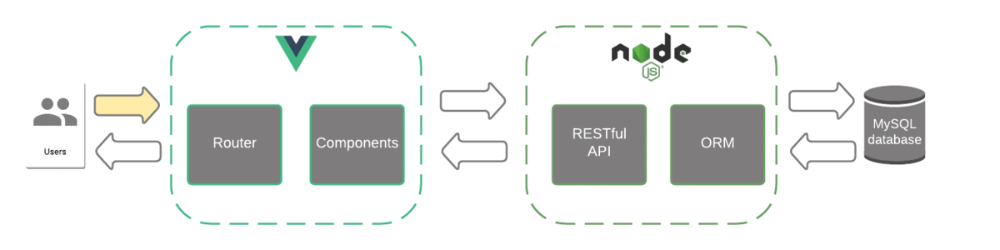

# Progetto di ingegneria del software

Questo progetto è stato realizzato per il corso di Ingegneria del Software presso l'Università di Trento.

## Tabella dei contenuti

- [Architettura](#architettura)
- [Struttura](#struttura)
- [Utilizzo](#utilizzo)
     - [Prerequisiti](#prerequisiti)
     - [Back-end](#back-end)
         - [Testing](#testing)
     - [Front-end](#front-end)
- [Crediti](#crediti)
        

## Architettura



- Vue Router consente la navigazione tra pagine
- Vue Client invia e riceve richieste http usando `axios`
- Express fornisce il collegamento alle API
- Sequelize ORM consente l'interazione tra db e applicazione

---

## Struttura
Struttura delle cartelle
```shell
back-end
├── app
│   ├── controllers
│   ├── docs
│   ├── routes
│   └── tests
└──  db
    ├── config
    ├── migrations
    ├── models
    └── seeders
    
front-end
├── public
└── src
    ├── assets
    ├── components
    └── services
```

## Utilizzo

### Prerequisiti

Aver già installato:
- [NodeJs & npm](https://nodejs.org/en/download/)
- [MySQL server](https://dev.mysql.com/downloads/mysql/)

### Back-end
Modificare il file `back-end/db/config/config.json` con i propri dati
```shell
cd back-end/  
npm ci 
npm run db:reset
npm start
```
Documentazione delle API disponibile all'indirizzo `http://localhost:8080/api-docs/`

#### Testing
```shell
npm test
```
### Front-end
```shell
cd front-end/
npm ci 
npm run serve
```

Server in esecuzione all'indirizzo `http://localhost:8081/`

---

## Crediti

La base di questo progetto è stata realizzata tramite questi tutorial:
- [Struttura generale](https://www.bezkoder.com/vue-js-node-js-express-mysql-crud-example/)
- [Sequelize CLI e testing](https://levelup.gitconnected.com/building-an-express-api-with-sequelize-cli-and-unit-testing-882c6875ed59)

